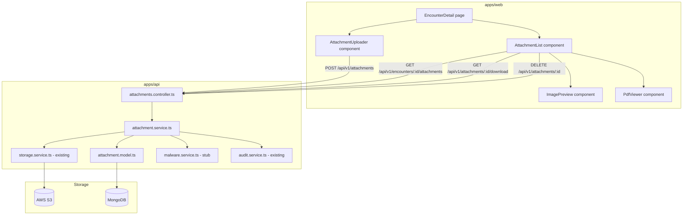

# Design Document: Encounter Attachments

## Overview

This feature adds clinical document attachment support to the Health Watchers platform. Doctors, nurses, and clinic admins can upload files (PDF, JPEG, PNG, DICOM) to encounters and patients. Files are stored in S3 with server-side encryption. Downloads use pre-signed URLs that expire in 15 minutes and are logged to the audit trail. A drag-and-drop upload component with image preview and PDF viewer is added to the encounter detail page.

The implementation follows the existing module pattern in `apps/api/src/modules/` and reuses the `storage.service.ts` already present in the `documents` module. The frontend follows the Next.js + React Query + Tailwind pattern used throughout `apps/web`.

---

## Architecture



**Request flow for upload:**
1. Client sends `multipart/form-data` to `POST /api/v1/attachments`
2. Multer middleware buffers the file in memory
3. Controller validates MIME type, extension, and file size
4. Malware scanner stub inspects the buffer
5. `storage.service.ts` uploads to S3 with `ServerSideEncryption: 'AES256'`
6. `AttachmentModel` document is created in MongoDB
7. 201 response with attachment metadata

**Request flow for download:**
1. Client sends `GET /api/v1/attachments/:id/download`
2. Controller looks up attachment, checks clinic ownership
3. `storage.service.ts` generates a pre-signed URL (900s expiry)
4. `audit.service.ts` writes `ATTACHMENT_DOWNLOAD` log entry
5. 302 redirect to pre-signed URL

---

## Components and Interfaces

### API Module: `apps/api/src/modules/attachments/`

```
attachments/
  attachment.model.ts        — Mongoose schema and TypeScript interface
  attachment.service.ts      — Business logic (upload, download, list, delete)
  attachment.validation.ts   — Zod schemas for request validation
  attachments.controller.ts  — Express router with all 5 endpoints
  malware.service.ts         — Stub malware scanner
```

### Attachment Service Interface

```typescript
interface AttachmentService {
  upload(params: UploadParams, file: Express.Multer.File): Promise<IAttachment>;
  getDownloadUrl(attachmentId: string, requestingUser: RequestUser): Promise<string>;
  listByEncounter(encounterId: string, clinicId: string, query: ListQuery): Promise<PaginatedResult<IAttachment>>;
  listByPatient(patientId: string, clinicId: string, query: ListQuery): Promise<PaginatedResult<IAttachment>>;
  deleteAttachment(attachmentId: string, requestingUser: RequestUser): Promise<void>;
}

interface UploadParams {
  encounterId?: string;
  patientId: string;
  clinicId: string;
  category: AttachmentCategory;
  uploadedBy: string;
}

interface ListQuery {
  page: number;
  limit: number;
  category?: AttachmentCategory;
}
```

### Malware Service Interface

```typescript
// apps/api/src/modules/attachments/malware.service.ts
export async function scanBuffer(buffer: Buffer): Promise<{ clean: boolean }> {
  // Stub: always returns clean. Replace with ClamAV integration.
  return { clean: true };
}
```

### Frontend Components: `apps/web/src/components/encounters/attachments/`

```
attachments/
  AttachmentUploader.tsx     — Drag-and-drop upload zone with progress
  AttachmentList.tsx         — List of attachments with actions
  ImagePreview.tsx           — Inline image preview modal
  PdfViewer.tsx              — PDF viewer using browser <iframe>
```

### Frontend API Client: `apps/web/src/lib/queries/attachments.ts`

```typescript
export function useEncounterAttachments(encounterId: string): UseQueryResult<Attachment[]>
export function useUploadAttachment(): UseMutationResult<Attachment, Error, UploadPayload>
export function useDeleteAttachment(): UseMutationResult<void, Error, string>
export function getAttachmentDownloadUrl(attachmentId: string): Promise<string>
```

---

## Data Models

### Attachment Model (`attachment.model.ts`)

```typescript
export type AttachmentCategory = 'lab_report' | 'imaging' | 'referral' | 'consent' | 'other';

export interface IAttachment {
  _id: Types.ObjectId;
  encounterId?: Types.ObjectId;   // optional — encounter-scoped
  patientId: Types.ObjectId;      // required
  clinicId: Types.ObjectId;       // required — for clinic scoping
  uploadedBy: Types.ObjectId;     // required — User ref
  fileName: string;               // sanitized storage filename
  originalName: string;           // original filename from uploader
  mimeType: string;               // e.g. 'application/pdf'
  fileSize: number;               // bytes
  storageKey: string;             // S3 object key
  category: AttachmentCategory;
  isDeleted: boolean;             // default false
  deletedAt?: Date;
  deletedBy?: Types.ObjectId;
  createdAt: Date;
  updatedAt: Date;
}
```

**Indexes:**
- `{ encounterId: 1, isDeleted: 1, createdAt: -1 }` — encounter list queries
- `{ patientId: 1, clinicId: 1, isDeleted: 1, createdAt: -1 }` — patient list queries
- `{ clinicId: 1 }` — clinic scoping

**Storage key format:** `attachments/{clinicId}/{patientId}/{uuid}{ext}`

Example: `attachments/507f1f77bcf86cd799439011/507f1f77bcf86cd799439012/a1b2c3d4-e5f6-7890-abcd-ef1234567890.pdf`

### AuditAction Extension

The `ATTACHMENT_DOWNLOAD` and `ATTACHMENT_DELETE` actions must be added to the `AuditAction` union type in `apps/api/src/modules/audit/audit.model.ts` and its enum array.

### Attachment API Response Shape

```typescript
interface AttachmentResponse {
  _id: string;
  encounterId?: string;
  patientId: string;
  clinicId: string;
  uploadedBy: string;
  fileName: string;
  originalName: string;
  mimeType: string;
  fileSize: number;
  category: AttachmentCategory;
  isDeleted: boolean;
  createdAt: string;
  updatedAt: string;
  // storageKey is NOT returned to clients
}
```

### Storage Service Extension

The existing `storage.service.ts` in `documents` module will be extended to support server-side encryption on upload:

```typescript
// Extended uploadFile params
interface UploadFileParams {
  storageKey: string;
  buffer: Buffer;
  mimeType: string;
  serverSideEncryption?: 'AES256' | 'aws:kms';  // new optional field
}
```

The `PutObjectCommand` will include `ServerSideEncryption: params.serverSideEncryption` when provided.

---

## API Endpoints

### POST /api/v1/attachments

- Auth: `DOCTOR | NURSE | CLINIC_ADMIN`
- Content-Type: `multipart/form-data`
- Body fields: `file` (binary), `patientId`, `clinicId`, `category`, `encounterId?`
- Multer: memory storage, 20 MB limit, MIME + extension filter
- Response 201: `{ status: 'success', data: AttachmentResponse }`
- Errors: 400 `InvalidFileType`, 413 `FileTooLarge`, 422 `MalwareDetected`, 404 encounter not found

### GET /api/v1/attachments/:id/download

- Auth: `DOCTOR | NURSE | CLINIC_ADMIN`
- Response 302: redirect to pre-signed URL
- Errors: 404 not found or deleted, 403 wrong clinic

### GET /api/v1/encounters/:id/attachments

- Auth: `DOCTOR | NURSE | CLINIC_ADMIN`
- Query: `page`, `limit`, `category`
- Response 200: `{ status: 'success', data: AttachmentResponse[], meta: PaginationMeta }`

### GET /api/v1/patients/:id/attachments

- Auth: `DOCTOR | NURSE | CLINIC_ADMIN`
- Query: `page`, `limit`, `category`
- Response 200: `{ status: 'success', data: AttachmentResponse[], meta: PaginationMeta }`

### DELETE /api/v1/attachments/:id

- Auth: `CLINIC_ADMIN | SUPER_ADMIN`
- Response 200: `{ status: 'success', message: 'Attachment deleted' }`
- Errors: 404 not found or wrong clinic

---

## Correctness Properties

*A property is a characteristic or behavior that should hold true across all valid executions of a system — essentially, a formal statement about what the system should do. Properties serve as the bridge between human-readable specifications and machine-verifiable correctness guarantees.*

### Property 1: Invalid file type rejection

*For any* file upload request where the MIME type is not in `{application/pdf, image/jpeg, image/png, application/dicom}` or the file extension is not in `{.pdf, .jpg, .jpeg, .png, .dcm}`, the Attachment_Uploader must reject the request with a 400 status and must not create any Attachment document or S3 object.

**Validates: Requirements 2.2, 2.3**

---

### Property 2: File size rejection

*For any* file upload request where the file buffer exceeds 20,971,520 bytes (20 MB), the Attachment_Uploader must reject the request with a 413 status and must not create any Attachment document or S3 object.

**Validates: Requirements 2.4**

---

### Property 3: Upload round-trip — metadata consistency

*For any* valid file upload (valid type, valid size, clean scan), the Attachment document returned in the 201 response must contain: the same `originalName` as the uploaded file's original filename, the same `mimeType`, the same `fileSize`, the provided `patientId`, `clinicId`, and `category`, and a `storageKey` matching the pattern `attachments/{clinicId}/{patientId}/{uuid}{ext}`.

**Validates: Requirements 2.7, 2.8, 1.1–1.13**

---

### Property 4: Download audit log invariant

*For any* successful download request (valid attachment, authorized user), exactly one `ATTACHMENT_DOWNLOAD` audit log entry must be created containing the correct `attachmentId`, `userId`, `clinicId`, and `patientId`.

**Validates: Requirements 3.5**

---

### Property 5: Pre-signed URL expiry

*For any* successful download request, the generated pre-signed URL must expire in exactly 900 seconds (15 minutes) from the time of generation.

**Validates: Requirements 3.4**

---

### Property 6: Listing never returns deleted attachments

*For any* encounter or patient attachment list query, no attachment with `isDeleted: true` must appear in the results, regardless of pagination parameters or category filters.

**Validates: Requirements 4.1, 4.2**

---

### Property 7: Category filter correctness

*For any* attachment list query with a `category` filter, every attachment in the result set must have a `category` field equal to the requested filter value.

**Validates: Requirements 4.3**

---

### Property 8: Pagination invariant

*For any* attachment list query with `limit` L (where 1 ≤ L ≤ 100), the number of items returned must be ≤ L, and the `meta.total` must equal the total count of matching non-deleted attachments. Any `limit` > 100 must be rejected.

**Validates: Requirements 4.4**

---

### Property 9: Sort order invariant

*For any* attachment list result with two or more items, for every adjacent pair (item[i], item[i+1]), `item[i].createdAt >= item[i+1].createdAt` (descending order).

**Validates: Requirements 4.5**

---

### Property 10: Deletion marks all soft-delete fields

*For any* attachment that is successfully deleted, the resulting document must have `isDeleted: true`, a non-null `deletedAt` timestamp, and `deletedBy` equal to the requesting user's ID. The S3 object at `storageKey` must no longer exist.

**Validates: Requirements 5.3, 5.4**

---

### Property 11: Attachment list UI reflects server state

*For any* successful upload via the AttachmentUploader component, the AttachmentList component must contain the newly uploaded attachment without a full page reload. *For any* successful delete confirmation, the deleted attachment must be removed from the AttachmentList without a full page reload.

**Validates: Requirements 6.6, 7.5**

---

### Property 12: Client-side validation prevents invalid uploads

*For any* file selected in the AttachmentUploader with an invalid MIME type or size exceeding 20 MB, no HTTP request to `POST /api/v1/attachments` must be initiated, and an inline error message must be displayed.

**Validates: Requirements 6.3, 6.4**

---

## Error Handling

| Scenario | HTTP Status | Error Code |
|---|---|---|
| Invalid MIME type or extension | 400 | `InvalidFileType` |
| File exceeds 20 MB | 413 | `FileTooLarge` |
| Malware detected | 422 | `MalwareDetected` |
| Missing required fields | 400 | `BadRequest` |
| Attachment not found or deleted | 404 | `NotFound` |
| Attachment belongs to different clinic | 403 | `Forbidden` |
| Encounter not found or wrong clinic | 404 | `NotFound` |
| S3 upload failure | 500 | `StorageError` |
| S3 delete failure | 500 | `StorageError` |
| Unauthorized (no token) | 401 | `Unauthorized` |
| Insufficient role | 403 | `Forbidden` |

**S3 failure handling:** If the S3 upload fails after the file passes validation, the controller returns 500 and does not create a MongoDB document. If S3 delete fails during attachment deletion, the controller returns 500 and does not update the MongoDB document (keeping it visible so the admin can retry).

**Audit log failures:** Following the existing pattern in `audit.service.ts`, audit log failures are caught and logged but do not fail the main request.

---

## Testing Strategy

### Unit Tests (Jest)

- `attachment.service.ts`: mock S3 client and MongoDB, test each service method
- `malware.service.ts`: verify stub returns `{ clean: true }` for any buffer
- `attachment.validation.ts`: test Zod schema validation for all request shapes
- `attachments.controller.ts`: mock service layer, test HTTP status codes and response shapes
- `AttachmentUploader.tsx`: mock fetch, test file validation logic and error display
- `AttachmentList.tsx`: mock React Query, test rendering of attachment metadata fields

Unit tests focus on specific examples, edge cases (empty file, exactly 20 MB, boundary MIME types), and error conditions.

### Property-Based Tests (fast-check)

The project uses Jest. Add `fast-check` as a dev dependency for property-based testing. Each property test runs a minimum of 100 iterations.

**Property test tag format:** `Feature: encounter-attachments, Property {N}: {property_text}`

- **Property 1** — Generate arbitrary MIME types not in the allowed set; verify 400 rejection and no DB document created.
  Tag: `Feature: encounter-attachments, Property 1: Invalid file type rejection`

- **Property 2** — Generate file buffers with sizes > 20 MB; verify 413 rejection.
  Tag: `Feature: encounter-attachments, Property 2: File size rejection`

- **Property 3** — Generate valid file metadata (name, size, type, category); verify returned document fields match inputs and storageKey matches pattern.
  Tag: `Feature: encounter-attachments, Property 3: Upload round-trip metadata consistency`

- **Property 4** — Generate valid download requests; verify audit log entry count and fields.
  Tag: `Feature: encounter-attachments, Property 4: Download audit log invariant`

- **Property 5** — Generate valid download requests; verify pre-signed URL expiry parameter is 900.
  Tag: `Feature: encounter-attachments, Property 5: Pre-signed URL expiry`

- **Property 6** — Generate attachment lists with a mix of deleted and non-deleted; verify no deleted items appear.
  Tag: `Feature: encounter-attachments, Property 6: Listing never returns deleted attachments`

- **Property 7** — Generate attachment lists with category filter; verify all results match filter.
  Tag: `Feature: encounter-attachments, Property 7: Category filter correctness`

- **Property 8** — Generate pagination params including limit > 100; verify result count ≤ limit and limit > 100 is rejected.
  Tag: `Feature: encounter-attachments, Property 8: Pagination invariant`

- **Property 9** — Generate attachment lists with multiple items; verify descending createdAt order.
  Tag: `Feature: encounter-attachments, Property 9: Sort order invariant`

- **Property 10** — Generate delete requests; verify soft-delete fields and S3 deletion.
  Tag: `Feature: encounter-attachments, Property 10: Deletion marks all soft-delete fields`

### Integration Tests

- Full upload → list → download → delete flow using an in-memory MongoDB (mongodb-memory-server) and mocked S3 client
- Verify clinic isolation: attachments from clinic A are not accessible to clinic B users
- Verify role enforcement: unauthenticated and wrong-role requests are rejected at each endpoint
