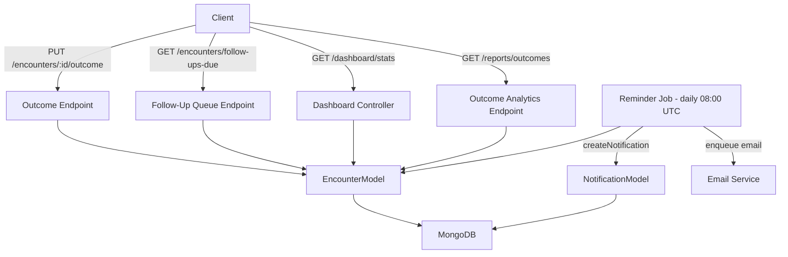

# Design Document: Encounter Outcome Tracking

## Overview

This feature extends the existing `Encounter` model with outcome and follow-up fields, adds a dedicated outcome recording endpoint, a follow-up queue endpoint, a daily reminder job, dashboard widget data, patient-level outcome history, and an outcome analytics report. All changes are additive and backward-compatible with existing encounter data.

The implementation follows the established patterns in the codebase:
- Mongoose schema extension with optional fields (no migration required for existing documents)
- Zod validation schemas for all new request bodies and query parameters
- Express Router handlers using `asyncHandler` and `requireRoles` middleware
- Background jobs using `setInterval` with `start`/`stop` exports (same as `payment-expiration-job`)
- In-app notifications via `createNotification` service; email via `email.service.ts` `enqueue`

---

## Architecture



---

## Components and Interfaces

### 1. Encounter Model Extension (`encounter.model.ts`)

New fields added to the `Encounter` interface and `encounterSchema`:

```typescript
outcome?: 'improved' | 'unchanged' | 'worsened' | 'resolved' | 'referred' | 'hospitalized';
outcomeNotes?: string;           // max 2000 chars
followUpRequired?: boolean;      // default false
followUpDate?: Date;
followUpCompleted?: boolean;     // default false
followUpEncounterId?: Schema.Types.ObjectId;  // ref: 'Encounter'
patientAdherence?: 'full' | 'partial' | 'none' | 'unknown';
```

Indexes added:
- `{ clinicId: 1, followUpRequired: 1, followUpDate: 1, followUpCompleted: 1 }` — supports the follow-up queue query efficiently.

### 2. Outcome Validation Schema (`encounter.validation.ts`)

New Zod schema `recordOutcomeSchema`:

```typescript
export const recordOutcomeSchema = z.object({
  outcome: z.enum(['improved','unchanged','worsened','resolved','referred','hospitalized']).optional(),
  outcomeNotes: z.string().max(2000).optional(),
  followUpRequired: z.boolean().optional(),
  followUpDate: z.string().datetime({ offset: true }).optional(),
  followUpCompleted: z.boolean().optional(),
  followUpEncounterId: objectId.optional(),
  patientAdherence: z.enum(['full','partial','none','unknown']).optional(),
}).refine(
  (d) => !(d.followUpRequired === true && !d.followUpDate),
  { message: 'followUpDate is required when followUpRequired is true', path: ['followUpDate'] }
);
```

New Zod schema `followUpQueueQuerySchema`:

```typescript
export const followUpQueueQuerySchema = z.object({
  doctorId: objectId.optional(),
  patientId: objectId.optional(),
  from: z.string().regex(/^\d{4}-\d{2}-\d{2}$/).optional(),
  to: z.string().regex(/^\d{4}-\d{2}-\d{2}$/).optional(),
  page: z.coerce.number().int().min(1).default(1),
  limit: z.coerce.number().int().min(1).max(100).default(20),
});
```

### 3. Outcome Recording Endpoint (`encounters.controller.ts`)

`PUT /api/v1/encounters/:id/outcome`

- Roles: `DOCTOR`, `CLINIC_ADMIN`
- Validates body with `recordOutcomeSchema`
- Verifies encounter exists and belongs to clinic (404 if not)
- Rejects `cancelled` encounters (409)
- If `followUpEncounterId` provided, verifies it belongs to same clinic (400 if not)
- Updates only outcome fields using `$set`
- Returns updated encounter via `toEncounterResponse`

### 4. Follow-Up Queue Endpoint (`encounters.controller.ts`)

`GET /api/v1/encounters/follow-ups-due`

- Roles: `DOCTOR`, `NURSE`, `CLINIC_ADMIN`
- Validates query with `followUpQueueQuerySchema`
- Base filter: `{ clinicId, followUpRequired: true, followUpCompleted: false, followUpDate: { $lte: today } }`
- Optional filters: `doctorId`, `patientId`, date range on `followUpDate`
- Sort: `{ followUpDate: 1 }` (most overdue first)
- Paginated response

### 5. Follow-Up Reminder Job (`follow-up-reminder-job.ts`)

New file: `apps/api/src/modules/encounters/follow-up-reminder-job.ts`

```
Daily at 08:00 UTC:
  1. Compute tomorrow's date range [tomorrowStart, tomorrowEnd)
  2. Query: { followUpRequired: true, followUpCompleted: false, followUpDate: { $gte: tomorrowStart, $lt: tomorrowEnd } }
  3. For each encounter:
     a. createNotification for attendingDoctorId (type: 'follow_up_reminder')
     b. Find Patient_User by patientId where role='PATIENT'
        - If found and emailNotifications enabled → send reminder email
        - If patient has contactNumber → include in notification metadata
  4. Log errors per-encounter, continue on failure
```

Scheduling: uses `setInterval` with a computed delay to the next 08:00 UTC, then 24-hour intervals. Exports `startFollowUpReminderJob` and `stopFollowUpReminderJob`.

### 6. Dashboard Extension (`dashboard.controller.ts`)

Adds to the existing `getStats` response:
- `followUpsDue`: array of up to 5 encounters (most overdue first)
  - For `DOCTOR` role: filtered to `attendingDoctorId === req.user.userId`
  - For `CLINIC_ADMIN`/`SUPER_ADMIN`: all clinic encounters
- `followUpsDueCount`: total count matching the same filter

### 7. Outcome Analytics Endpoint (`reports.controller.ts`)

`GET /api/v1/reports/outcomes`

- Roles: `CLINIC_ADMIN`, `SUPER_ADMIN`
- Optional `from`/`to` date filters on `createdAt`
- Returns:
  - `outcomeDistribution`: `{ improved: N, unchanged: N, worsened: N, resolved: N, referred: N, hospitalized: N }`
  - `followUpComplianceRate`: `(followUpCompleted=true count / followUpRequired=true count) * 100`, or `null` if denominator is 0
  - `avgDaysToResolution`: average of `(followUpDate - createdAt)` in days for `outcome='resolved'` encounters, or `null` if none

### 8. Notification Type Extension

- `notification.model.ts`: add `'follow_up_reminder'` to `NOTIFICATION_TYPES`
- `user.model.ts`: add `follow_up_reminder: { type: Boolean, default: true }` to `notificationTypes` preference map and `UserPreferences` interface

### 9. Transformer Extension (`encounters.transformer.ts`)

`EncounterResponse` interface and `toEncounterResponse` function extended to include all new outcome fields.

---

## Data Models

### Updated Encounter Document (MongoDB)

```
{
  // ... existing fields ...
  outcome:              String (enum, optional),
  outcomeNotes:         String (optional, max 2000),
  followUpRequired:     Boolean (default: false),
  followUpDate:         Date (optional),
  followUpCompleted:    Boolean (default: false),
  followUpEncounterId:  ObjectId → Encounter (optional),
  patientAdherence:     String (enum, optional)
}
```

### Follow-Up Queue Response

```json
{
  "status": "success",
  "data": [ /* EncounterResponse[] */ ],
  "meta": { "total": 12, "page": 1, "limit": 20 }
}
```

### Outcome Analytics Response

```json
{
  "status": "success",
  "data": {
    "outcomeDistribution": {
      "improved": 42,
      "unchanged": 10,
      "worsened": 3,
      "resolved": 25,
      "referred": 5,
      "hospitalized": 2
    },
    "followUpComplianceRate": 78.5,
    "avgDaysToResolution": 14.2
  }
}
```

---

## Correctness Properties

*A property is a characteristic or behavior that should hold true across all valid executions of a system — essentially, a formal statement about what the system should do. Properties serve as the bridge between human-readable specifications and machine-verifiable correctness guarantees.*

### Property-Based Testing Overview

Property-based testing (PBT) validates software correctness by testing universal properties across many generated inputs. Each property is a formal specification that should hold for all valid inputs.

**Core Principles**
1. Universal Quantification: Every property contains an explicit "for all" statement
2. Requirements Traceability: Each property references the requirements it validates
3. Executable Specifications: Properties are implementable as automated tests
4. Comprehensive Coverage: Properties cover all testable acceptance criteria

**Library**: Use `fast-check` (already available in the TypeScript ecosystem) with a minimum of 100 runs per property.

---

Property 1: followUpDate required when followUpRequired is true

*For any* outcome payload where `followUpRequired` is `true` and `followUpDate` is absent, the `recordOutcomeSchema` Zod validator SHALL return a validation error.

**Validates: Requirements 1.8, 2.7**

---

Property 2: followUpDate not required when followUpRequired is false or absent

*For any* outcome payload where `followUpRequired` is `false` or not set, the `recordOutcomeSchema` Zod validator SHALL succeed regardless of whether `followUpDate` is present.

**Validates: Requirements 1.3, 1.4**

---

Property 3: Outcome field enum enforcement

*For any* string value that is not one of `['improved','unchanged','worsened','resolved','referred','hospitalized']`, the `recordOutcomeSchema` Zod validator SHALL return a validation error for the `outcome` field.

**Validates: Requirements 1.1**

---

Property 4: Adherence field enum enforcement

*For any* string value that is not one of `['full','partial','none','unknown']`, the `recordOutcomeSchema` Zod validator SHALL return a validation error for the `patientAdherence` field.

**Validates: Requirements 1.7**

---

Property 5: Follow-up queue only returns overdue, incomplete follow-ups

*For any* set of encounters in the database, the follow-up queue endpoint SHALL return only encounters where `followUpRequired` is `true`, `followUpCompleted` is `false`, and `followUpDate` is on or before today. No encounter outside these criteria SHALL appear in the result.

**Validates: Requirements 3.1**

---

Property 6: Follow-up queue is sorted ascending by followUpDate

*For any* non-empty follow-up queue result, for every adjacent pair of results `(a, b)`, `a.followUpDate <= b.followUpDate` SHALL hold.

**Validates: Requirements 3.2**

---

Property 7: Follow-up compliance rate is bounded between 0 and 100

*For any* set of encounters with outcome data, the `followUpComplianceRate` returned by the analytics endpoint SHALL be a number in the range `[0, 100]` or `null` when no follow-ups are required.

**Validates: Requirements 7.2**

---

Property 8: Outcome distribution counts are non-negative and sum correctly

*For any* set of encounters with recorded outcomes, the sum of all values in `outcomeDistribution` SHALL equal the total number of encounters that have an `outcome` field set within the filtered date range.

**Validates: Requirements 7.1**

---

Property 9: Outcome recording does not mutate non-outcome fields

*For any* encounter and any valid outcome payload, after a successful `PUT /encounters/:id/outcome`, the non-outcome fields (`chiefComplaint`, `diagnosis`, `treatmentPlan`, `vitalSigns`, `prescriptions`, `notes`, `status`, `patientId`, `attendingDoctorId`) SHALL remain unchanged.

**Validates: Requirements 2.1**

---

Property 10: Reminder job processes all matching encounters and skips non-matching ones

*For any* set of encounters, the reminder job SHALL send notifications for exactly those encounters where `followUpRequired` is `true`, `followUpCompleted` is `false`, and `followUpDate` falls within tomorrow's date range — and SHALL NOT send notifications for any other encounters.

**Validates: Requirements 4.2, 4.3**

---

## Error Handling

| Scenario | HTTP Status | Error Code |
|---|---|---|
| Encounter not found or wrong clinic | 404 | `NotFound` |
| Encounter is cancelled | 409 | `Conflict` |
| `followUpRequired=true` without `followUpDate` | 400 | `BadRequest` |
| `followUpEncounterId` belongs to different clinic | 400 | `BadRequest` |
| Invalid enum value for `outcome` or `patientAdherence` | 400 | `ValidationError` |
| Insufficient role | 403 | `Forbidden` |

Reminder job errors are logged per-encounter using the existing `logger.error` utility and do not propagate — the job continues processing remaining encounters.

---

## Testing Strategy

**Dual Testing Approach**: unit tests for specific examples and edge cases; property-based tests for universal correctness.

**Unit Tests** (Jest, existing framework):
- `recordOutcomeSchema` validation: valid payload, missing `followUpDate` when required, invalid enum values, `followUpEncounterId` cross-clinic check
- Outcome endpoint: 404 on missing encounter, 409 on cancelled encounter, 200 with correct field isolation
- Follow-up queue: correct filter construction, pagination, role enforcement
- Analytics: compliance rate calculation (0 denominator → null, partial compliance, full compliance)
- Reminder job: `expireFollowUpReminders` function with mocked DB and notification service

**Property-Based Tests** (fast-check, minimum 100 runs each):

Each property test MUST be tagged with a comment in the format:
`// Feature: encounter-outcome-tracking, Property N: <property_text>`

- Property 1: `fc.record({ followUpRequired: fc.constant(true) })` → schema rejects missing `followUpDate`
- Property 2: `fc.record({ followUpRequired: fc.constant(false) })` → schema accepts regardless of `followUpDate`
- Property 3: `fc.string()` filtered to non-enum values → schema rejects `outcome`
- Property 4: `fc.string()` filtered to non-enum values → schema rejects `patientAdherence`
- Property 5: Generate random encounter sets, insert into test DB, assert queue filter correctness
- Property 6: Generate random follow-up queue results, assert ascending `followUpDate` order
- Property 7: Generate random encounter sets with outcome data, assert compliance rate in `[0,100]` or `null`
- Property 8: Generate random encounter sets, assert distribution sum equals total with outcome set
- Property 9: Generate random encounters + outcome payloads, assert non-outcome fields unchanged after update
- Property 10: Generate random encounter sets, run reminder job logic, assert notification targets match exactly
