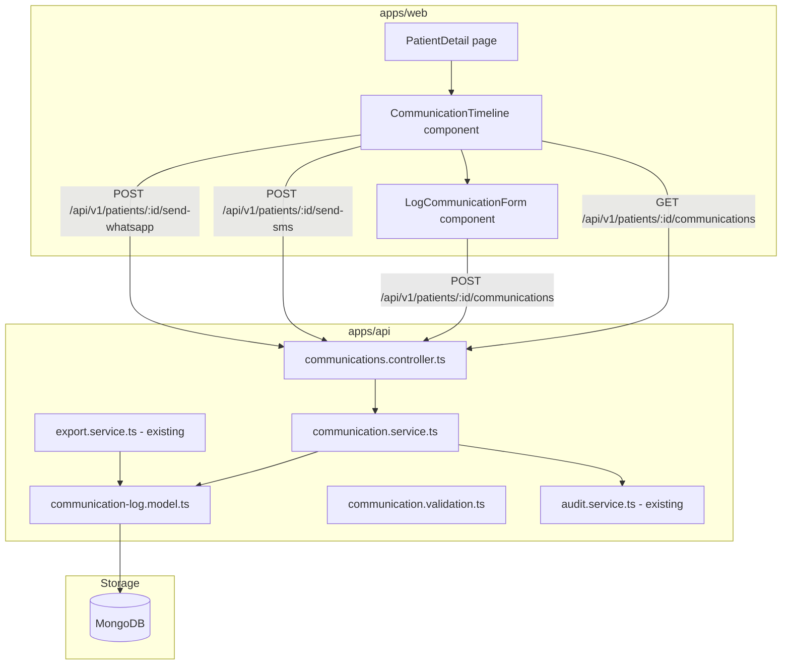

# Design Document: Patient Communication Log

## Overview

This feature adds a patient communication log to the Health Watchers platform. Clinics can log and retrieve communications with patients across five channels (SMS, WhatsApp, email, phone call, in-person). The implementation adds a `CommunicationLog` Mongoose model, four REST API endpoints under `/api/v1/patients/:id/communications`, stub endpoints for Twilio-based SMS and WhatsApp sending, a communication timeline tab on the patient detail page, and a Communication History section in the patient PDF export.

The implementation follows the existing module pattern in `apps/api/src/modules/` and reuses the `authenticate` / `requireRoles` middleware, the `paginate` utility, and the `auditLog` service. The frontend follows the Next.js + React Query + Tailwind pattern used throughout `apps/web`.

---

## Architecture



**Request flow for logging a communication:**
1. Client sends `POST /api/v1/patients/:id/communications` with JSON body
2. `authenticate` middleware validates JWT and attaches user to request
3. `requireRoles` middleware enforces `DOCTOR | NURSE | CLINIC_ADMIN`
4. Zod validation middleware validates request body
5. Controller verifies patient belongs to authenticated clinic
6. Service creates `CommunicationLog` document with `sentBy` and `clinicId` set from the authenticated user
7. Service calls `auditLog` with action `COMMUNICATION_LOG_CREATED`, omitting `content` from metadata
8. 201 response with the created document

**Request flow for listing communications:**
1. Client sends `GET /api/v1/patients/:id/communications?page=1&limit=20`
2. Auth and role middleware run
3. Controller verifies patient belongs to authenticated clinic
4. Service queries `CommunicationLogModel` with clinic scoping, optional channel/direction filters, and `sentAt: -1` sort
5. `paginate` utility returns paginated result with `meta`
6. Service calls `auditLog` with action `COMMUNICATION_LOG_VIEWED`, omitting content from metadata
7. 200 response with `{ data, meta }`

---

## Components and Interfaces

### API Module: `apps/api/src/modules/communications/`

```
communications/
  communication-log.model.ts    — Mongoose schema and TypeScript interface
  communication.service.ts      — Business logic (log, list)
  communication.validation.ts   — Zod schemas for request validation
  communications.controller.ts  — Express router with all four endpoints
```

### Communication Service Interface

```typescript
interface CommunicationService {
  logCommunication(patientId: string, params: LogParams, user: RequestUser): Promise<ICommunicationLog>;
  listCommunications(patientId: string, clinicId: string, query: ListQuery): Promise<PaginatedResult<ICommunicationLog>>;
}

interface LogParams {
  channel: CommunicationChannel;
  direction: CommunicationDirection;
  content: string;
  status: CommunicationStatus;
  sentAt: Date;
  relatedEncounterId?: string;
  twilioMessageSid?: string;
}

interface ListQuery {
  page: number;
  limit: number;
  channel?: CommunicationChannel;
  direction?: CommunicationDirection;
}
```

### Frontend Components: `apps/web/src/components/patients/communications/`

```
communications/
  CommunicationTimeline.tsx     — Tab content with timeline list and pagination
  LogCommunicationForm.tsx      — Modal form for logging manual communications
  CommunicationEntry.tsx        — Single timeline entry card
```

### Frontend API Client: `apps/web/src/lib/queries/communications.ts`

```typescript
export function usePatientCommunications(patientId: string, query?: ListQuery): UseQueryResult<PaginatedCommunications>
export function useLogCommunication(): UseMutationResult<CommunicationLog, Error, LogPayload>
```

---

## Data Models

### CommunicationLog Model (`communication-log.model.ts`)

```typescript
export type CommunicationChannel = 'sms' | 'whatsapp' | 'email' | 'phone_call' | 'in_person';
export type CommunicationDirection = 'outbound' | 'inbound';
export type CommunicationStatus = 'sent' | 'delivered' | 'failed' | 'read';

export interface ICommunicationLog {
  _id: Types.ObjectId;
  patientId: Types.ObjectId;       // required — Patient ref
  clinicId: Types.ObjectId;        // required — Clinic ref, set server-side
  sentBy: Types.ObjectId;          // required — User ref, set server-side
  channel: CommunicationChannel;   // required
  direction: CommunicationDirection; // required
  content: string;                 // required — message text or call summary
  status: CommunicationStatus;     // required
  sentAt: Date;                    // required
  deliveredAt?: Date;              // optional
  readAt?: Date;                   // optional
  relatedEncounterId?: Types.ObjectId; // optional — Encounter ref
  twilioMessageSid?: string;       // optional — Twilio tracking ID
  createdAt: Date;
  updatedAt: Date;
}
```

**Indexes:**
- `{ patientId: 1, clinicId: 1, sentAt: -1 }` — primary list query index
- `{ clinicId: 1 }` — clinic scoping
- `{ patientId: 1, channel: 1 }` — channel filter queries

### AuditAction Extension

Two new actions must be added to the `AuditAction` union type and enum array in `apps/api/src/modules/audit/audit.model.ts`:
- `COMMUNICATION_LOG_CREATED`
- `COMMUNICATION_LOG_VIEWED`

### API Response Shape

```typescript
interface CommunicationLogResponse {
  _id: string;
  patientId: string;
  clinicId: string;
  sentBy: string;
  channel: CommunicationChannel;
  direction: CommunicationDirection;
  content: string;
  status: CommunicationStatus;
  sentAt: string;
  deliveredAt?: string;
  readAt?: string;
  relatedEncounterId?: string;
  twilioMessageSid?: string;
  createdAt: string;
  updatedAt: string;
}
```

### Export Service Extension

`buildPatientRecord` in `apps/api/src/modules/export/export.service.ts` must be extended to query `CommunicationLogModel` for the patient and include the results in the returned record. `sendPatientPdf` must be extended to render a "Communication History" section using the communication log data.

---

## API Endpoints

### POST /api/v1/patients/:id/communications

- Auth: `DOCTOR | NURSE | CLINIC_ADMIN`
- Content-Type: `application/json`
- Body: `{ channel, direction, content, status, sentAt, relatedEncounterId?, twilioMessageSid? }`
- Response 201: `{ status: 'success', data: CommunicationLogResponse }`
- Errors: 400 validation error, 401 unauthenticated, 403 forbidden, 404 patient not found

### GET /api/v1/patients/:id/communications

- Auth: `DOCTOR | NURSE | CLINIC_ADMIN`
- Query: `page`, `limit`, `channel?`, `direction?`
- Response 200: `{ status: 'success', data: CommunicationLogResponse[], meta: { total, page, limit } }`
- Errors: 401, 403, 404 patient not found

### POST /api/v1/patients/:id/send-sms

- Auth: `DOCTOR | NURSE | CLINIC_ADMIN`
- Response 501: `{ status: 'error', message: 'SMS sending is not yet configured. Please configure Twilio to enable this feature.' }`
- Errors: 401, 403

### POST /api/v1/patients/:id/send-whatsapp

- Auth: `DOCTOR | NURSE | CLINIC_ADMIN`
- Response 501: `{ status: 'error', message: 'WhatsApp sending is not yet configured. Please configure Twilio to enable this feature.' }`
- Errors: 401, 403

---

## Correctness Properties

*A property is a characteristic or behavior that should hold true across all valid executions of a system — essentially, a formal statement about what the system should do. Properties serve as the bridge between human-readable specifications and machine-verifiable correctness guarantees.*

### Property 1: Communication log round-trip field completeness

*For any* valid communication log creation request (with all required fields), the document returned in the 201 response must contain all fields from the request body (`channel`, `direction`, `content`, `status`, `sentAt`), plus server-assigned fields (`patientId` matching the URL parameter, `clinicId` matching the authenticated user's clinic, `sentBy` matching the authenticated user's ID), and all optional fields that were provided (`relatedEncounterId`, `twilioMessageSid`).

**Validates: Requirements 1.1–1.12, 2.1, 2.7, 2.8**

---

### Property 2: Invalid enum value rejection

*For any* request body where `channel` is not in `{sms, whatsapp, email, phone_call, in_person}`, or `direction` is not in `{outbound, inbound}`, or `status` is not in `{sent, delivered, failed, read}`, the Communication_Logger must reject the request with a 400 status and must not create any CommunicationLog document.

**Validates: Requirements 1.4, 1.5, 1.7, 2.4, 2.5, 2.6**

---

### Property 3: Server-side field override

*For any* communication log creation request, the `sentBy` field in the created document must equal the authenticated user's ID and the `clinicId` field must equal the authenticated user's clinic ID, regardless of any values provided in the request body for those fields.

**Validates: Requirements 2.7, 2.8**

---

### Property 4: Clinic isolation

*For any* request to a communication endpoint where the patient's `clinicId` does not match the authenticated user's `clinicId`, the system must return a 404 response and must not return or create any CommunicationLog documents belonging to a different clinic.

**Validates: Requirements 2.2, 3.2, 9.3**

---

### Property 5: Role enforcement

*For any* request to any communication endpoint from a user without an Authorized_Role (`DOCTOR`, `NURSE`, or `CLINIC_ADMIN`), the system must return a 403 response. For any unauthenticated request (no valid JWT), the system must return a 401 response.

**Validates: Requirements 2.9, 3.8, 4.2, 5.2, 9.1, 9.2**

---

### Property 6: Pagination invariant

*For any* list query with `limit` L (where 1 ≤ L ≤ 100), the number of items in the `data` array must be ≤ L, and `meta.total` must equal the total count of CommunicationLog entries matching the patient and clinic scope (and any applied filters). Any `limit` > 100 must be clamped or rejected.

**Validates: Requirements 3.3, 3.7**

---

### Property 7: Sort order invariant

*For any* communication list result with two or more items, for every adjacent pair (item[i], item[i+1]), `item[i].sentAt >= item[i+1].sentAt` (descending order by `sentAt`).

**Validates: Requirements 3.4**

---

### Property 8: Filter correctness

*For any* list query with a `channel` filter value C, every entry in the result set must have `channel === C`. *For any* list query with a `direction` filter value D, every entry in the result set must have `direction === D`. When both filters are applied simultaneously, every entry must satisfy both constraints.

**Validates: Requirements 3.5, 3.6**

---

### Property 9: Stub endpoints return 501 with no side effects

*For any* request to `POST /api/v1/patients/:id/send-sms` or `POST /api/v1/patients/:id/send-whatsapp` from an authenticated authorized user, the response status must be 501 and the total count of CommunicationLog documents in the database must not increase.

**Validates: Requirements 4.1, 4.3, 5.1, 5.3**

---

### Property 10: Audit log privacy invariant

*For any* CommunicationLog creation or list retrieval, the corresponding audit log entry's `metadata` object must not contain a `content` field or any field whose value is the message content string.

**Validates: Requirements 10.1, 10.2**

---

### Property 11: PDF export communication history completeness

*For any* patient with N communication log entries, the generated PDF must contain a "Communication History" section, and for each entry the section must include the `sentAt`, `channel`, `direction`, `status`, and `content` values. When N = 0, the section must contain the text "No communications on record."

**Validates: Requirements 8.1, 8.2, 8.3**

---

### Property 12: Form validation prevents invalid submissions

*For any* state of the LogCommunicationForm where one or more required fields (`channel`, `direction`, `content`, `status`, `sentAt`) are empty or invalid, submitting the form must display inline validation errors and must not initiate any HTTP request to `POST /api/v1/patients/:id/communications`.

**Validates: Requirements 7.3, 7.4**

---

## Error Handling

| Scenario | HTTP Status | Error Code |
|---|---|---|
| Missing required body field | 400 | `BadRequest` |
| Invalid enum value (channel, direction, status) | 400 | `BadRequest` |
| Unauthenticated request | 401 | `Unauthorized` |
| Insufficient role | 403 | `Forbidden` |
| Patient not found or belongs to different clinic | 404 | `NotFound` |
| SMS sending not configured | 501 | `NotImplemented` |
| WhatsApp sending not configured | 501 | `NotImplemented` |
| Database write failure | 500 | `InternalServerError` |

**Audit log failures:** Following the existing pattern in `audit.service.ts`, audit log failures are caught and logged but do not fail the main request.

**Clinic isolation:** Patient lookup always includes `{ _id: patientId, clinicId: authenticatedClinicId }` to prevent cross-clinic data access. A missing patient and a cross-clinic patient both return 404 (no information leakage).

---

## Testing Strategy

### Unit Tests (Jest)

- `communication-log.model.ts`: verify schema validation rejects invalid enum values and missing required fields
- `communication.service.ts`: mock MongoDB, test `logCommunication` sets `sentBy` and `clinicId` from user context; test `listCommunications` applies filters and pagination correctly
- `communication.validation.ts`: test Zod schema validation for all request shapes including edge cases
- `communications.controller.ts`: mock service layer, test HTTP status codes and response shapes for all four endpoints
- `CommunicationTimeline.tsx`: mock React Query, test rendering of entries, empty state, and loading state
- `LogCommunicationForm.tsx`: test client-side validation prevents submission with missing fields

Unit tests focus on specific examples, edge cases (empty content, boundary limit values), and error conditions.

### Property-Based Tests (fast-check)

The project uses Jest. Add `fast-check` as a dev dependency for property-based testing. Each property test runs a minimum of 100 iterations.

**Property test tag format:** `Feature: patient-communication-log, Property {N}: {property_text}`

- **Property 1** — Generate random valid communication log inputs; verify round-trip field completeness in the 201 response.
  Tag: `Feature: patient-communication-log, Property 1: Communication log round-trip field completeness`

- **Property 2** — Generate arbitrary strings not in the valid enum sets for `channel`, `direction`, and `status`; verify 400 rejection and no document created.
  Tag: `Feature: patient-communication-log, Property 2: Invalid enum value rejection`

- **Property 3** — Generate valid requests with arbitrary `sentBy` and `clinicId` values in the body; verify the created document uses the authenticated user's values.
  Tag: `Feature: patient-communication-log, Property 3: Server-side field override`

- **Property 4** — Generate requests targeting patients from a different clinic; verify 404 response and no data leakage.
  Tag: `Feature: patient-communication-log, Property 4: Clinic isolation`

- **Property 5** — Generate requests from users with non-authorized roles and unauthenticated requests; verify 403 and 401 responses respectively.
  Tag: `Feature: patient-communication-log, Property 5: Role enforcement`

- **Property 6** — Generate pagination params including limit > 100; verify result count ≤ limit and meta.total accuracy.
  Tag: `Feature: patient-communication-log, Property 6: Pagination invariant`

- **Property 7** — Generate communication log sets with multiple entries; verify descending sentAt order in all results.
  Tag: `Feature: patient-communication-log, Property 7: Sort order invariant`

- **Property 8** — Generate list queries with channel and direction filters; verify all results satisfy the filter constraints.
  Tag: `Feature: patient-communication-log, Property 8: Filter correctness`

- **Property 9** — Generate valid authenticated requests to send-sms and send-whatsapp; verify 501 response and no CommunicationLog documents created.
  Tag: `Feature: patient-communication-log, Property 9: Stub endpoints return 501 with no side effects`

- **Property 10** — Generate communication log creation and list requests; verify audit log metadata never contains the content field.
  Tag: `Feature: patient-communication-log, Property 10: Audit log privacy invariant`

- **Property 11** — Generate patients with N communication log entries (including N=0); verify PDF contains the Communication History section with all required fields.
  Tag: `Feature: patient-communication-log, Property 11: PDF export communication history completeness`

- **Property 12** — Generate form states with missing required fields; verify no HTTP request is initiated and validation errors are displayed.
  Tag: `Feature: patient-communication-log, Property 12: Form validation prevents invalid submissions`

### Integration Tests

- Full log → list → filter flow using in-memory MongoDB (mongodb-memory-server)
- Verify clinic isolation: communications from clinic A are not accessible to clinic B users
- Verify role enforcement: unauthenticated and wrong-role requests are rejected at each endpoint
- Verify audit log entries are created with correct fields and without content
