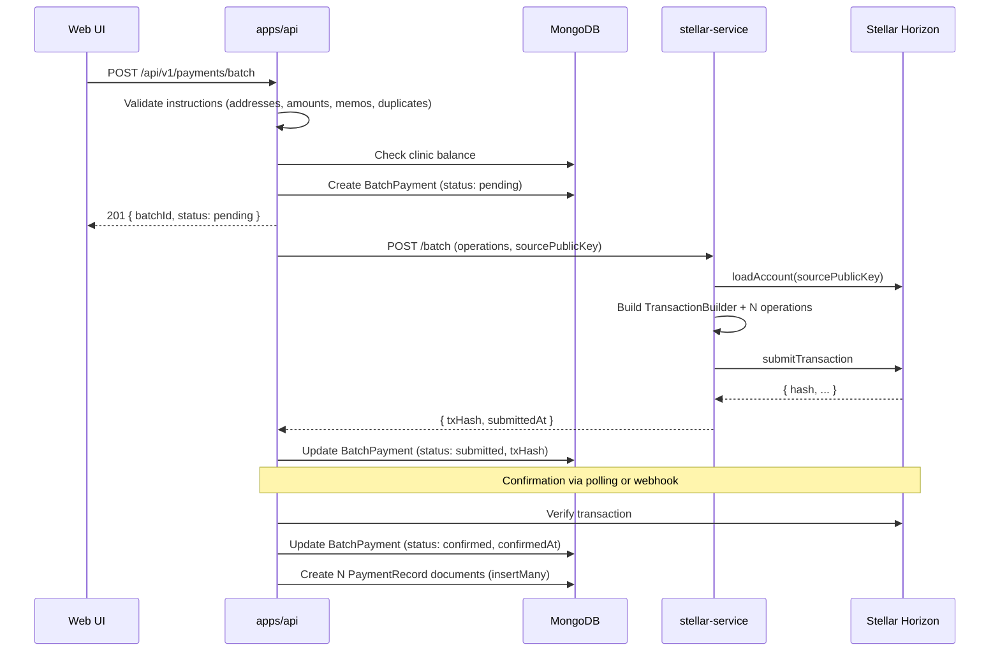

# Design Document: Stellar Batch Payments

## Overview

This design extends the Health Watchers payment system to support batch payment processing via Stellar. A single Stellar transaction can carry up to 100 payment operations, making it possible to pay multiple recipients atomically. The implementation adds a `BatchPayment` MongoDB model, a batch API controller in the existing `payments` module, a new `POST /batch` endpoint in `stellar-service`, and a frontend batch UI in the Next.js web app.

The key architectural constraint is **atomicity**: Stellar executes all operations in a transaction or none of them. This simplifies error handling — there is no partial-success state to reconcile.

---

## Architecture



---

## Components and Interfaces

### 1. API: Batch Payment Controller (`apps/api/src/modules/payments/batch.controller.ts`)

New Express router mounted at `/api/v1/payments/batch`.

**Endpoints:**

| Method | Path | Auth | Description |
|--------|------|------|-------------|
| `POST` | `/api/v1/payments/batch` | CLINIC_ADMIN, SUPER_ADMIN | Submit a new batch |
| `GET` | `/api/v1/payments/batch` | All read roles | List batches for clinic |
| `GET` | `/api/v1/payments/batch/:batchId` | All read roles | Get single batch status |

**POST /batch request body:**
```typescript
{
  payments: Array<{
    destination: string;  // Stellar public key (G...)
    amount: string;       // positive numeric string, max 7 decimals
    memo?: string;        // optional, max 28 bytes UTF-8
  }>;
  currency: 'XLM' | 'USDC';
}
```

**POST /batch response (201):**
```typescript
{
  status: 'success';
  data: BatchPaymentResponse;  // see Data Models
}
```

**GET /batch query params:**
```typescript
{
  status?: 'pending' | 'submitted' | 'confirmed' | 'failed';
  page?: number;   // default 1
  limit?: number;  // default 20, max 100
}
```

### 2. API: Batch Validation (`apps/api/src/modules/payments/batch.validation.ts`)

Zod schemas for request validation:

```typescript
const paymentInstructionSchema = z.object({
  destination: z.string().regex(/^G[A-Z2-7]{55}$/, 'Invalid Stellar public key'),
  amount: z.string().regex(/^\d+(\.\d{1,7})?$/, 'Invalid amount'),
  memo: z.string().optional().refine(
    (m) => !m || Buffer.byteLength(m, 'utf8') <= 28,
    'Memo exceeds 28-byte limit'
  ),
});

const createBatchSchema = z.object({
  payments: z.array(paymentInstructionSchema).min(1).max(100),
  currency: z.enum(['XLM', 'USDC']),
});
```

Duplicate destination check is performed in the controller after schema validation.

### 3. API: Stellar Client Extension (`apps/api/src/modules/payments/services/stellar-client.ts`)

Add a `submitBatch` method to the existing `StellarClient` class:

```typescript
async submitBatch(params: {
  operations: Array<{ destination: string; amount: string; memo?: string; assetCode: string; assetIssuer?: string }>;
  sourcePublicKey: string;
  currency: string;
}): Promise<{ txHash: string; submittedAt: string }>
```

### 4. Stellar Service: Batch Endpoint (`apps/stellar-service/src/index.ts`)

New protected endpoint `POST /batch`:

```typescript
// Request body
{
  operations: Array<{
    destination: string;
    amount: string;
    memo?: string;
    assetCode: string;
    assetIssuer?: string;
  }>;
  sourcePublicKey: string;
}

// Response
{
  success: true;
  txHash: string;
  submittedAt: string;  // ISO timestamp
}
```

### 5. Stellar Service: Batch Transaction Builder (`apps/stellar-service/src/stellar.ts`)

New `buildAndSubmitBatch` function:

```typescript
export async function buildAndSubmitBatch(
  sourcePublicKey: string,
  operations: BatchOperation[],
): Promise<{ txHash: string; submittedAt: string }>
```

This function:
1. Loads the source account from Horizon (once)
2. Creates a `TransactionBuilder`
3. Adds one `Operation.payment` per instruction
4. Sets timeout to 300 seconds
5. Signs with the platform secret key
6. Submits to Horizon
7. Returns `{ txHash, submittedAt }`

### 6. Web: Batch Payment Page (`apps/web/src/app/payments/batch/`)

New pages:
- `page.tsx` — server component, renders `BatchPaymentClient`
- `BatchPaymentClient.tsx` — CSV upload + manual entry + preview
- `[batchId]/page.tsx` — server component, renders `BatchStatusClient`
- `[batchId]/BatchStatusClient.tsx` — status display with polling

New components:
- `apps/web/src/components/payments/BatchPaymentForm.tsx` — manual entry form
- `apps/web/src/components/payments/BatchPreview.tsx` — preview table + totals
- `apps/web/src/components/payments/BatchStatusTable.tsx` — per-payment status rows
- `apps/web/src/components/payments/CsvUpload.tsx` — file input + parser

---

## Data Models

### BatchPayment (MongoDB)

```typescript
export interface PaymentInstruction {
  destination: string;
  amount: string;
  memo?: string;
}

export interface BatchPayment {
  batchId: string;           // UUID, unique
  clinicId: string;          // indexed
  createdBy: string;         // user ID
  payments: PaymentInstruction[];
  status: 'pending' | 'submitted' | 'confirmed' | 'failed';
  currency: string;          // 'XLM' | 'USDC'
  totalAmount: string;       // sum of all payment amounts
  txHash?: string;
  submittedAt?: Date;
  confirmedAt?: Date;
  failureReason?: string;
}
```

MongoDB schema indexes: `batchId` (unique), `clinicId`, `status`, compound `{ clinicId, createdAt }`.

### PaymentRecord extension

Add optional `batchId` field to the existing `PaymentRecord` schema:

```typescript
batchId?: string;  // references BatchPayment.batchId
```

### totalAmount computation

`totalAmount` is computed server-side as:

```typescript
const total = payments
  .reduce((sum, p) => sum + parseFloat(p.amount), 0)
  .toFixed(7);
```

This is computed once at creation time and stored; it is never recomputed from the array.

---

## Correctness Properties

*A property is a characteristic or behavior that should hold true across all valid executions of a system — essentially, a formal statement about what the system should do. Properties serve as the bridge between human-readable specifications and machine-verifiable correctness guarantees.*

### Property 1: Valid batch creates pending record with correct totalAmount

*For any* array of 1–100 valid `PaymentInstruction` objects, submitting them via `POST /api/v1/payments/batch` should return HTTP 201 with a `BatchPayment` whose `status` is `pending` and whose `totalAmount` equals the sum of all instruction amounts (to 7 decimal places).

**Validates: Requirements 1.2, 4.3**

---

### Property 2: Role-based access control on batch submission

*For any* authenticated user whose role is not `CLINIC_ADMIN` or `SUPER_ADMIN`, calling `POST /api/v1/payments/batch` with a valid payload should return HTTP 403.

**Validates: Requirements 1.6, 1.7**

---

### Property 3: Destination address validation rejects invalid keys

*For any* batch containing at least one `Payment_Instruction` with a destination that is not a valid Stellar public key (56-character string starting with `G` using base32 alphabet), the API should return HTTP 400 with a structured error identifying the failing index.

**Validates: Requirements 2.1, 2.6**

---

### Property 4: Amount validation rejects malformed values

*For any* batch containing at least one `Payment_Instruction` with an amount that is not a positive numeric string with at most 7 decimal places (e.g., negative, zero, non-numeric, more than 7 decimals), the API should return HTTP 400 with a structured error identifying the failing index.

**Validates: Requirements 2.2, 2.6**

---

### Property 5: Memo byte-length validation

*For any* batch containing at least one `Payment_Instruction` whose memo, when encoded as UTF-8, exceeds 28 bytes, the API should return HTTP 400 with a structured error identifying the failing index. This property must hold for multi-byte Unicode characters (e.g., emoji, CJK characters) where character count differs from byte count.

**Validates: Requirements 2.3, 2.6**

---

### Property 6: Duplicate destination rejection

*For any* batch containing two or more `Payment_Instruction` objects with the same destination address, the API should return HTTP 400 with a structured error identifying the duplicate indices.

**Validates: Requirements 2.5, 2.6**

---

### Property 7: No database records created on validation failure

*For any* batch request that fails validation (invalid address, amount, memo, duplicate, or over-limit), the number of `BatchPayment` documents in the database should be unchanged after the request.

**Validates: Requirements 2.7**

---

### Property 8: Batch transaction operation count matches instruction count

*For any* valid batch of N instructions (1 ≤ N ≤ 100), the Stellar transaction built by `stellar-service` should contain exactly N payment operations.

**Validates: Requirements 3.1, 3.4**

---

### Property 9: BatchPayment state machine transitions are monotonic

*For any* `BatchPayment`, the status should only transition in the forward direction: `pending` → `submitted` → `confirmed` or `pending` → `submitted` → `failed`. A `confirmed` or `failed` batch should never transition to any other status.

**Validates: Requirements 4.4, 4.5, 4.6**

---

### Property 10: Confirmed batch produces correct PaymentRecord count and fields

*For any* `BatchPayment` with N instructions that transitions to `confirmed`, exactly N `PaymentRecord` documents should be created, each with `status: confirmed`, `txHash` matching the batch `txHash`, `confirmedAt` matching the batch `confirmedAt`, `clinicId` matching the batch `clinicId`, and `batchId` referencing the batch.

**Validates: Requirements 5.1, 5.2, 5.3**

---

### Property 11: Cross-clinic batch isolation

*For any* two clinics A and B, a user authenticated as clinic A should receive HTTP 404 when requesting `GET /api/v1/payments/batch/:batchId` for a batch that belongs to clinic B.

**Validates: Requirements 6.2, 6.3**

---

### Property 12: CSV parser memo byte-length enforcement

*For any* CSV row whose memo field, when encoded as UTF-8, exceeds 28 bytes, the client-side CSV parser should mark that row as invalid and not include it in the submittable payment list.

**Validates: Requirements 7.3**

---

### Property 13: Batch preview totalAmount equals sum of instruction amounts

*For any* list of parsed `PaymentInstruction` objects displayed in the batch preview UI, the displayed total amount should equal the arithmetic sum of all individual amounts (to 7 decimal places).

**Validates: Requirements 8.2**

---

## Error Handling

### Validation errors (400)

All validation failures return a structured body:

```json
{
  "error": "BatchValidationError",
  "message": "Batch validation failed",
  "details": [
    { "index": 2, "field": "destination", "message": "Invalid Stellar public key" },
    { "index": 5, "field": "memo", "message": "Memo exceeds 28-byte limit" }
  ]
}
```

### Stellar submission errors (502)

If `stellar-service` returns an error or is unreachable:

```json
{
  "error": "StellarServiceError",
  "message": "<error from stellar-service or Horizon>"
}
```

The `BatchPayment` is updated to `failed` with the `failureReason` set to the error message.

### Balance insufficient (400)

```json
{
  "error": "InsufficientBalance",
  "message": "Batch total 150.0000000 XLM exceeds available balance 100.0000000 XLM"
}
```

### PaymentRecord creation failure

If `insertMany` fails after a batch is confirmed, the error is logged at `error` level with the `batchId` and the `BatchPayment` remains in `confirmed` status. A background reconciliation job (existing `reconciliation-job.ts`) can be extended to detect and retry this case.

---

## Testing Strategy

### Unit tests

- Validation logic: test each validation rule with valid and invalid inputs
- `totalAmount` computation: test with various decimal precisions
- CSV parser: test with valid CSV, missing columns, invalid rows, >100 rows
- State machine: test each allowed and disallowed transition

### Property-based tests

Use **fast-check** (already available in the TypeScript ecosystem) for the API and **fast-check** or **jest-fast-check** for the web.

Each property test runs a minimum of **100 iterations**.

Tag format: `Feature: stellar-batch-payments, Property N: <property_text>`

| Property | Test location | Library |
|----------|--------------|---------|
| 1 — Valid batch creates pending record | `apps/api/src/modules/payments/batch.controller.test.ts` | fast-check |
| 2 — RBAC on batch submission | `apps/api/src/modules/payments/batch.controller.test.ts` | fast-check |
| 3 — Destination address validation | `apps/api/src/modules/payments/batch.validation.test.ts` | fast-check |
| 4 — Amount validation | `apps/api/src/modules/payments/batch.validation.test.ts` | fast-check |
| 5 — Memo byte-length validation | `apps/api/src/modules/payments/batch.validation.test.ts` | fast-check |
| 6 — Duplicate destination rejection | `apps/api/src/modules/payments/batch.controller.test.ts` | fast-check |
| 7 — No DB records on validation failure | `apps/api/src/modules/payments/batch.controller.test.ts` | fast-check |
| 8 — Operation count matches instruction count | `apps/stellar-service/src/stellar.test.ts` | fast-check |
| 9 — State machine monotonic transitions | `apps/api/src/modules/payments/models/batch-payment.model.test.ts` | fast-check |
| 10 — Confirmed batch PaymentRecord count and fields | `apps/api/src/modules/payments/batch.controller.test.ts` | fast-check |
| 11 — Cross-clinic isolation | `apps/api/src/modules/payments/batch.controller.test.ts` | fast-check |
| 12 — CSV parser memo enforcement | `apps/web/src/components/payments/CsvUpload.test.ts` | fast-check |
| 13 — Preview totalAmount sum | `apps/web/src/components/payments/BatchPreview.test.ts` | fast-check |

### Integration tests

- End-to-end: POST batch → verify BatchPayment created → mock stellar-service response → verify status update → verify PaymentRecords created
- Use `mongodb-memory-server` for DB tests (already used in the project)
- Mock `stellar-service` HTTP calls with `nock` or `msw`
