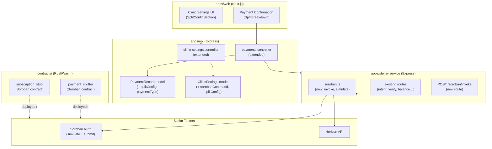

# Design Document: Stellar Soroban Integration

## Overview

This design extends the Health Watchers payment system with Stellar Soroban smart contract support. The integration adds two Rust/Wasm contracts (a payment splitter and a subscription stub), extends the `stellar-service` microservice with a Soroban invocation layer, adds split configuration to clinic settings and payment intents, and provides a frontend UI for configuring and confirming split payments.

The existing architecture — `stellar-service` as a standalone microservice, `PaymentRecord` in MongoDB, `ClinicSettings` for per-clinic configuration — is preserved and extended rather than replaced.

---

## Architecture



---

## Components and Interfaces

### 1. Soroban Contracts (`contracts/`)

A new top-level `contracts/` directory contains two Rust crates managed as a Cargo workspace.

**`contracts/payment_splitter/`**

```rust
// Core interface
fn split_payment(env: Env, total_amount: i128, recipients: Vec<Recipient>) -> Result<(), Error>

struct Recipient {
    address: Address,
    percentage: u32,  // 1–99, all must sum to 100
}
```

The contract validates that percentages sum to 100, then executes one `token::transfer` per recipient atomically. It emits a `split_complete` event with the disbursement details.

**`contracts/subscription_stub/`**

```rust
// Stub interface — all return Err(Error::NotImplemented)
fn deposit(env: Env, amount: i128, subscriber: Address) -> Result<(), Error>
fn release(env: Env, amount: i128, platform: Address) -> Result<(), Error>
fn cancel_with_refund(env: Env, subscriber: Address) -> Result<i128, Error>
```

### 2. Stellar Service Extension (`apps/stellar-service/src/soroban.ts`)

New module added to the stellar-service:

```typescript
interface InvokeContractRequest {
  contractId: string;       // 'C...' Stellar contract address
  functionName: string;     // e.g. 'split_payment'
  args: xdr.ScVal[];        // encoded arguments
  sourcePublicKey: string;  // signing account
}

interface InvokeContractResult {
  txHash: string;
  successful: boolean;
  simulationFee: string;
}

// Simulate then submit
async function invokeContract(req: InvokeContractRequest): Promise<InvokeContractResult>

// Simulate only (for validation/fee estimation)
async function simulateContract(req: InvokeContractRequest): Promise<SorobanRpc.Api.SimulateTransactionResponse>

// Build ScVal arguments from a SplitConfig
function buildSplitArgs(amount: string, recipients: SplitRecipient[]): xdr.ScVal[]
```

New route in `index.ts`:
```
POST /soroban/invoke   (requireSecret)
  Body: { contractId, functionName, amount, recipients }
  Returns: { success, txHash, simulationFee }
```

### 3. API: Payment Intent Extension

**`PaymentRecord` model additions:**
```typescript
splitConfig?: {
  recipients: Array<{ destination: string; percentage: number }>;
};
paymentType?: 'direct' | 'split';
sorobanContractId?: string;
```

**`createPaymentIntentSchema` additions (Zod):**
```typescript
splitConfig: z.object({
  recipients: z.array(z.object({
    destination: z.string().min(56).max(56),
    percentage: z.number().int().min(1).max(99),
  })).min(2).max(10),
}).optional(),
sorobanContractId: z.string().regex(/^C[A-Z2-7]{55}$/).optional(),
```

**Controller logic for split intents:**
1. Validate `splitConfig.recipients` percentages sum to 100.
2. If `sorobanContractId` not provided, resolve from `ClinicSettings.sorobanContractId`.
3. If still unresolved, return 400.
4. Set `paymentType: 'split'` on the record.
5. Invoke `POST /soroban/invoke` on the stellar-service.

### 4. API: Clinic Settings Extension

**`IClinicSettings` additions:**
```typescript
sorobanContractId?: string;   // validated: /^C[A-Z2-7]{55}$/
splitConfig?: {
  recipients: Array<{ destination: string; percentage: number }>;
};
```

**Settings controller** — the existing `PUT /api/v1/settings` handler is extended to accept and persist `sorobanContractId` and `splitConfig`. Validation of the contract ID format is applied server-side.

### 5. Frontend: Split Configuration UI

**New component: `SplitConfigSection.tsx`** (added to `apps/web/src/components/settings/`)

- Renders within the existing `ClinicSettingsClient` as a new "Payment Splitting" section.
- Manages a local array of `{ destination: string; percentage: number }` entries.
- Displays a running percentage total; highlights in red when total ≠ 100.
- Disables the save button when total ≠ 100.
- Includes a text input for `sorobanContractId` with format hint.

### 6. Frontend: Split Breakdown in Payment Confirmation

**Extended: `ConfirmPaymentModal.tsx`** (or a new `SplitBreakdown.tsx` sub-component)

- When `paymentType === 'split'`, renders a table of recipients with calculated amounts.
- Amount per recipient: `(percentage / 100) * parseFloat(totalAmount)`, formatted to 7 decimal places.
- After confirmation, shows a Stellar Explorer link: `https://stellar.expert/explorer/testnet/tx/{txHash}`.

---

## Data Models

### PaymentRecord (extended)

```typescript
{
  // existing fields...
  paymentType: 'direct' | 'split';          // default: 'direct'
  splitConfig?: {
    recipients: Array<{
      destination: string;   // Stellar public key (G...)
      percentage: number;    // integer 1–99
    }>;
  };
  sorobanContractId?: string;               // C... contract address
  sorobanTxHash?: string;                   // hash of the contract invocation tx
}
```

### IClinicSettings (extended)

```typescript
{
  // existing fields...
  sorobanContractId?: string;
  splitConfig?: {
    recipients: Array<{
      destination: string;
      percentage: number;
    }>;
  };
}
```

### SplitConfig (shared type in `packages/types/`)

```typescript
export interface SplitRecipient {
  destination: string;   // Stellar public key
  percentage: number;    // integer 1–99
}

export interface SplitConfig {
  recipients: SplitRecipient[];  // 2–10 entries, percentages sum to 100
}
```

---

## Correctness Properties

*A property is a characteristic or behavior that should hold true across all valid executions of a system — essentially, a formal statement about what the system should do. Properties serve as the bridge between human-readable specifications and machine-verifiable correctness guarantees.*

### Property 1: Split percentages must sum to exactly 100

*For any* array of `SplitRecipient` objects, the split validator SHALL accept the config if and only if the sum of all `percentage` values equals exactly 100.

**Validates: Requirements 1.3, 3.2, 8.4**

---

### Property 2: Recipient amount calculation is correct and complete

*For any* valid `SplitConfig` (percentages sum to 100) and any positive total amount, the sum of all calculated recipient amounts `(percentage / 100) * totalAmount` SHALL equal `totalAmount` within a floating-point tolerance of 0.0000001 XLM.

**Validates: Requirements 1.2, 8.5**

---

### Property 3: Recipient count boundaries are enforced

*For any* `SplitConfig`, the validator SHALL reject configs with fewer than 2 recipients or more than 10 recipients, and SHALL accept configs with 2 to 10 recipients (when percentages also sum to 100).

**Validates: Requirements 1.5**

---

### Property 4: Contract ID format validation

*For any* string input, the contract ID validator SHALL accept strings that match `/^C[A-Z2-7]{55}$/` and SHALL reject all other strings.

**Validates: Requirements 2.3, 2.4**

---

### Property 5: Split payment intent stores config and sets paymentType

*For any* valid payment intent creation request that includes a `splitConfig`, the resulting `PaymentRecord` SHALL have `paymentType === 'split'` and SHALL contain a `splitConfig` field whose recipients match the input.

**Validates: Requirements 3.1, 3.4**

---

### Property 6: Soroban simulation is always called before submission

*For any* contract invocation request, the Stellar_Service SHALL call the Soroban RPC `simulateTransaction` endpoint before calling `sendTransaction`. If simulation fails, `sendTransaction` SHALL NOT be called.

**Validates: Requirements 4.3, 4.4**

---

### Property 7: Split breakdown display amounts are correct

*For any* split payment intent with a valid `splitConfig` and `amount`, the UI split breakdown SHALL display each recipient's amount as `(percentage / 100) * parseFloat(amount)` formatted to 7 decimal places.

**Validates: Requirements 7.2**

---

### Property 8: Stellar public key format validation (UI)

*For any* string input in the recipient destination field, the UI validator SHALL accept strings that are exactly 56 characters long and start with 'G', and SHALL reject all other strings.

**Validates: Requirements 6.2**

---

## Error Handling

| Scenario | Component | Response |
|---|---|---|
| Split percentages ≠ 100 | API / UI | 400 `InvalidSplitConfig` |
| No Contract_ID resolvable | API | 400 `MissingContractId` |
| Invalid Contract_ID format | API / UI | 400 `InvalidContractId` |
| Soroban RPC simulation fails | stellar-service | 502 `SorobanSimulationError` with details |
| Soroban RPC unreachable | stellar-service | 502 `SorobanRpcUnavailable` |
| Recipient count out of bounds | API / contract | 400 `InvalidRecipientCount` |
| Invalid recipient public key | API / contract | 400 `InvalidRecipientAddress` |

All errors from the stellar-service Soroban endpoint are propagated to the API caller with the original error message preserved in the response body.

---

## Testing Strategy

### Unit Tests

- `splitValidator` — test percentage sum validation with specific examples (all equal, one dominant, off-by-one)
- `buildSplitArgs` — test XDR encoding of known Split_Config values
- `SplitConfigSection` component — render tests for the settings UI section
- `SplitBreakdown` component — render tests for the confirmation breakdown

### Property-Based Tests

Using **fast-check** (TypeScript) for the stellar-service and API, and **proptest** (Rust) for the Soroban contracts.

Each property test runs a minimum of **100 iterations**.

| Property | Library | Tag |
|---|---|---|
| Property 1: Split percentages sum to 100 | fast-check | `Feature: stellar-soroban-integration, Property 1` |
| Property 2: Amount calculation completeness | fast-check | `Feature: stellar-soroban-integration, Property 2` |
| Property 3: Recipient count boundaries | fast-check | `Feature: stellar-soroban-integration, Property 3` |
| Property 4: Contract ID format validation | fast-check | `Feature: stellar-soroban-integration, Property 4` |
| Property 5: Split intent stores config | fast-check | `Feature: stellar-soroban-integration, Property 5` |
| Property 6: Simulation before submission | fast-check (mock RPC) | `Feature: stellar-soroban-integration, Property 6` |
| Property 7: Split breakdown display amounts | fast-check | `Feature: stellar-soroban-integration, Property 7` |
| Property 8: Stellar public key validation | fast-check | `Feature: stellar-soroban-integration, Property 8` |

**Mock Soroban RPC**: Tests for the stellar-service Soroban invocation layer use a Jest mock of `SorobanRpc.Server` to simulate both success and failure paths without requiring a live testnet connection.

**Rust contract tests**: The `payment_splitter` contract uses `soroban-sdk`'s built-in test environment (`soroban_sdk::testutils`) with `proptest` for property-based validation of split logic.
